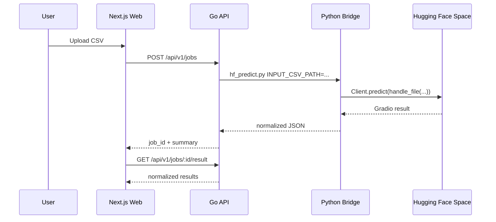

```mermaid
sequenceDiagram
  participant U as User
  participant W as Next.js Web
  participant A as Go API
  participant P as Python Bridge
  participant H as Hugging Face Space

  U->>W: Upload CSV
  W->>A: POST /api/v1/jobs
  A->>P: hf_predict.py INPUT_CSV_PATH=...
  P->>H: Client.predict(handle_file(...))
  H-->>P: Gradio result
  P-->>A: normalized JSON
  A-->>W: job_id + summary
  W->>A: GET /api/v1/jobs/:id/result
  A-->>W: normalized results
```
